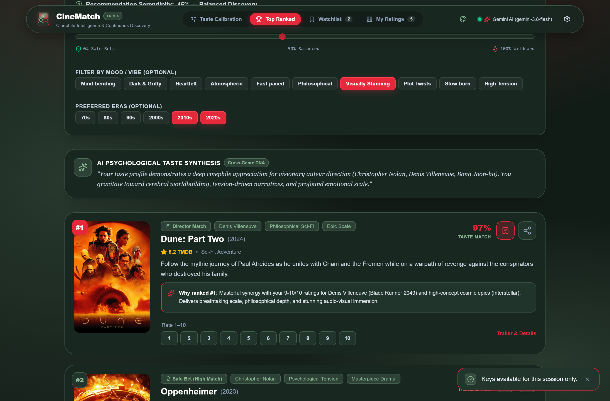
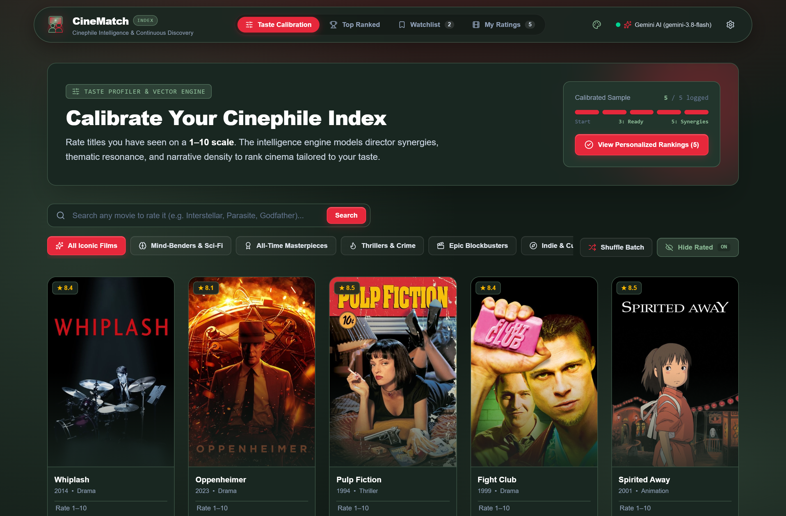
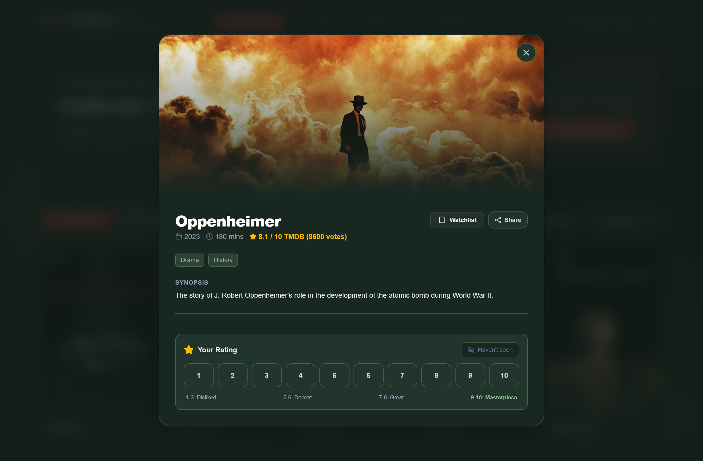
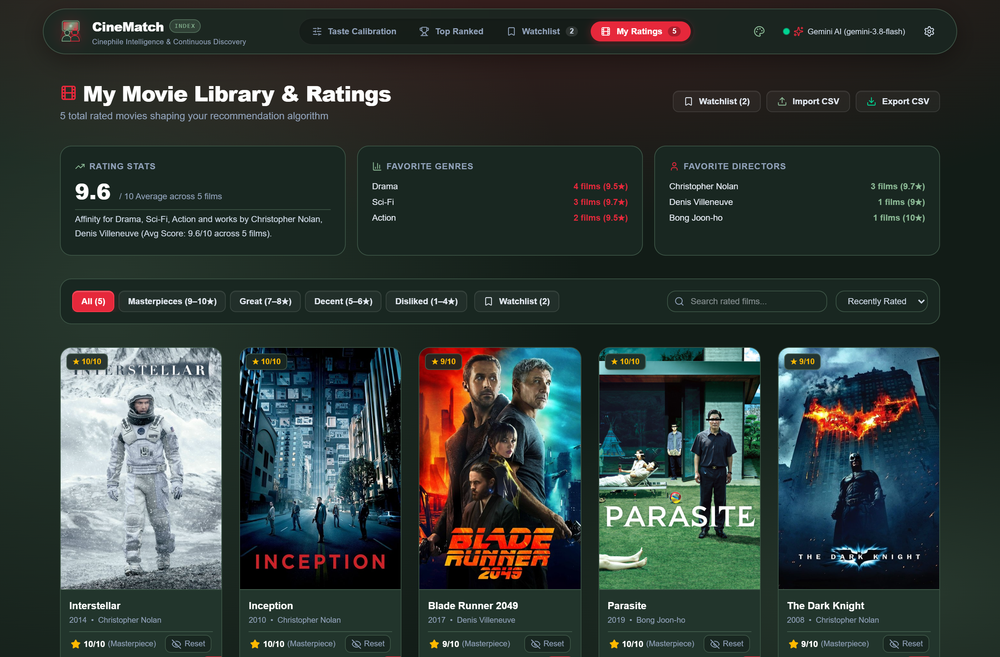
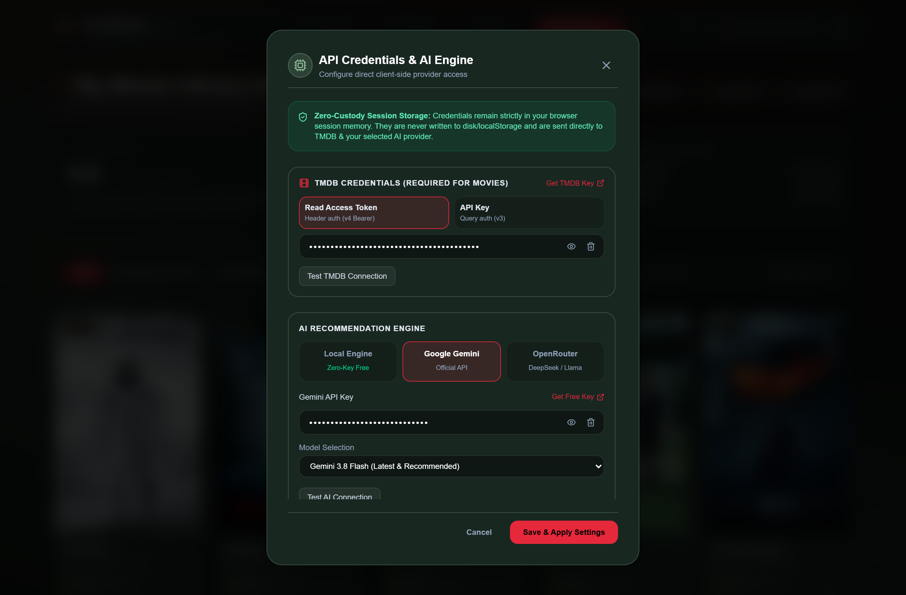
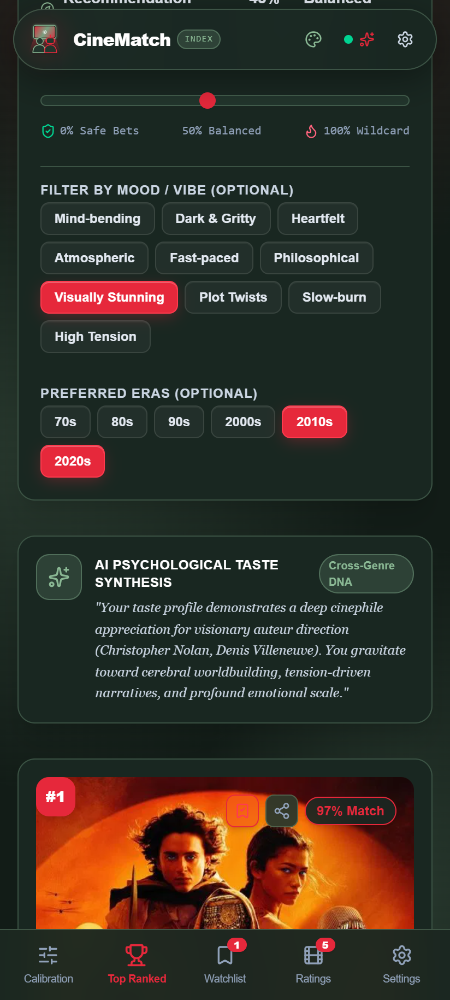
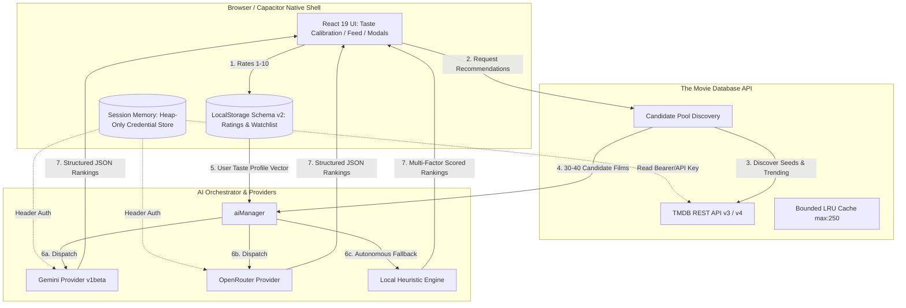

# CineMatch AI 🎬✨

[](https://react.dev/)
[](https://www.typescriptlang.org/)
[](https://vitejs.dev/)
[](https://tailwindcss.com/)
[](https://capacitorjs.com/)
[](https://vitest.dev/)
[](https://www.themoviedb.org/)

**CineMatch AI** is a private, client-first movie recommendation platform and cinephile taste profiler. Combining rich movie metadata from **The Movie Database (TMDB)** with a **Modular AI Engine** (Google Gemini, OpenRouter, or a 100% offline Local Heuristic Engine), CineMatch analyzes your personal taste profile across a 1–10 grading scale to generate hyper-personalized, context-aware film recommendations.

Built with a **zero-hosted-backend philosophy**, CineMatch operates under a **Bring-Your-Own-Key (BYOK)** model: user credentials and movie ratings never touch third-party servers, keeping your movie data completely in your own hands.

---

## 📸 App Showcase

<p align="center">
  
  <br />
  <em>Top Ranked AI Recommendations featuring match scoring, cross-genre psychological taste synthesis, and dynamic serendipity calibration.</em>
</p>

<table width="100%">
  <tr>
    <td width="50%" align="center">
      
      <br />
      <b>Taste Calibration Grid</b>
      <br />
      <em>Grade iconic films on a 1–10 scale across curated pillars (Mind-Benders, Masterpieces, Blockbusters, Crime).</em>
    </td>
    <td width="50%" align="center">
      
      <br />
      <b>Rich Movie Details</b>
      <br />
      <em>Cinematic backdrop modal with synopses, director credits, cast info, trailers, and instant rating actions.</em>
    </td>
  </tr>
  <tr>
    <td width="50%" align="center">
      
      <br />
      <b>Taste Profile & Library</b>
      <br />
      <em>Deep cinephile analytics, average scores, favorite directors, top genres, and CSV import/export.</em>
    </td>
    <td width="50%" align="center">
      
      <br />
      <b>Modular AI Engine (BYOK)</b>
      <br />
      <em>Zero-custody session credentials with direct access to Gemini, OpenRouter, or the offline Local Engine.</em>
    </td>
  </tr>
</table>

<p align="center">
  
  <br />
  <em>Responsive mobile UI with safe area notch handling, haptic rating feedback, and fluid bottom navigation.</em>
</p>

---

## 🌟 Key Features

### 🎯 1. Nuanced 1–10 Taste Calibration
- **Beyond Binary Thumbs:** Replace crude "like/dislike" or coarse 5-star ratings with a fine-grained 1–10 scale, distinguishing casual watches (6/10) from all-time masterpieces (10/10).
- **Curated Archetype Pillars:** Rapidly onboard with curated category filters: *All-Time Masterpieces*, *Mind-Benders & Sci-Fi*, *Thrillers & Crime*, *Epic Blockbusters*, *Indie & Cult Classics*, and *Heartfelt & Comedy*.
- **Intelligent Deduplication:** Automatic franchise clustering prevents candidate feeds from being overrun by long-running series sequels.

### 🧠 2. Modular Multi-Provider AI Architecture
- **Google Gemini (v1beta):** Direct native integration with `gemini-3.8-flash` (default & recommended), `gemini-3.7-flash`, `gemini-2.5-flash`, and `gemini-2.5-pro`. Delivers structured psychological taste profiles and contextual rationales for every recommendation.
- **OpenRouter Cloud:** Tap into verified free models including `openrouter/free` (Free Models Router), `google/gemma-4-31b-it:free`, `nvidia/nemotron-3.5-lightning:free`, and others, plus **Custom Model** entry for any model ID (free models require `:free` suffix, paid models supported with your own API key; includes automatic `<think>` tag stripping).
- **Local Smart Engine (Zero-Key Mode):** Don't have an AI API key? CineMatch includes an autonomous, client-side heuristic engine that scores candidates using multi-factor vector math completely offline.

### 🎛️ 3. Serendipity & Exploration Controls
- **Serendipity Temperature Slider:** Adjust discovery from **0% (Safe Bets)** to **100% (Wildcard Discoveries)** to control how far outside your comfort zone the algorithm ventures.
- **Categorized Recommendation Badges:** Visual tags highlight *Safe Bets*, *Director Matches*, *Thematic Gems*, and *Wildcard Discoveries*.
- **Mood & Era Filtering:** Narrow recommendations down by vibe (*Mind-bending*, *Dark & Gritty*, *Atmospheric*, *Visually Stunning*, *Slow-burn*) and era (*70s*, *80s*, *90s*, *2000s*, *2010s*, *2020s*).

### 📚 4. Comprehensive Library, Watchlist & Data Portability
- **Taste Analytics:** Real-time breakdown of your rating distribution, overall average score, top directors, and dominant genres.
- **Watchlist Sync:** Seamlessly bookmark discovered films for later viewing.
- **CSV & Letterboxd Interoperability:** Export your entire rating library to CSV or import existing Letterboxd/IMDb exports with fuzzy title matching and release year verification.

### 🎨 5. Bespoke Cinephile Themes & Typography
- Choose from curated film-stock colorways via the Palette Switcher:
  - **Autumn Maple & Moss:** Earthy forest greens and crimson accents.
  - **Criterion Noir & Gold:** Archival black, champagne gold, and vintage charcoal.
  - **A24 Midnight Velvet:** Midnight plum and vibrant neon accents.
  - **MUBI Scandi Cyan:** Minimalist Nordic arctic navy and ice blue.
  - **Celluloid 35mm:** Kodak analog warmth and vintage amber.
  - **Neo-Noir Slate:** Tailored obsidian and electric indigo.

### 📱 6. Mobile & Android Native Ergonomics (Capacitor)
- Native Android shell powered by **Capacitor 8**.
- Haptic tactile feedback on ratings via `@capacitor/haptics`.
- Dynamic notch and system navigation bar awareness via CSS safe-area insets.
- Hardware back-button hierarchical navigation (closes active modals before exiting).
- System-level native share sheet integration.

---

## 🏗️ Technical Architecture

CineMatch is built on a **pure client-to-API architecture** with zero intermediary servers:



---

## 🔒 Security & Privacy Model

CineMatch adheres to strict zero-knowledge principles:

1. **Web Environment (Zero Disk Secrets):**
   - API keys (TMDB, Gemini, OpenRouter) are held strictly in JavaScript heap runtime memory.
   - Credentials are **never** written to `localStorage`, `sessionStorage`, `IndexedDB`, cookies, or analytics.
   - Closing or reloading the tab immediately flushes keys from memory.
2. **Android Environment (Hardware-Backed Keystore):**
   - On native Android, users may opt to "Remember on this device".
   - Keys are encrypted with **AES-256-GCM** using a non-exportable hardware key held in the **Android Keystore** (`com.cinematch.app.credentials.v1`).
   - Cloud backup is strictly disabled (`android:allowBackup="false"`), preventing keys from syncing to Google Drive or external shares.
3. **Transport Hygiene:**
   - Keys are transmitted directly from your device to the API provider.
   - Gemini authentication uses request headers (`x-goog-api-key`), OpenRouter uses `Authorization: Bearer`, and TMDB URLs redact secrets in logs.

---

## 💾 Local Storage Schema (v2)

User taste data persists locally in browser `localStorage` with versioned isolation and storage quota resilience:

| Storage Key | Type | Description |
| :--- | :--- | :--- |
| `cinematch_user_ratings_v2` | `Record<number, UserRating>` | User rated movies with 1–10 scores, director, genres, and timestamps. |
| `cinematch_watchlist_v2` | `number[]` | Bookmarked TMDB film IDs. |
| `cinematch_watchlist_movies_v2` | `Record<number, Movie>` | Cached metadata for instant watchlist rendering without re-fetching. |
| `cinematch_ai_settings_v2` | `AISettings` | Active provider, model ID, serendipity level, selected vibes, and era filters *(contains no secrets)*. |
| `cinematch_cached_recs_v2` | `CachedRecommendations` | Most recent recommendation run, timestamp, and AI taste analysis. |

---

## 🧮 Local Heuristic Scoring Engine (Offline)

When running without an AI key, CineMatch employs a deterministic multi-dimensional scoring formula:

$$\text{FinalScore} = \text{clamp}\left(\text{Base} + S_{\text{genre}} + S_{\text{director}} + S_{\text{quality}} + \Delta_{\text{serendipity}},\, 45,\, 99\right)$$

- **Genre Affinity ($S_{\text{genre}}$):** Weighted sum over overlapping genres. Films matching a $10/10$ rated genre receive $+3.0$ per match; films sharing genres rated $\le 3/10$ receive a $-4.0$ penalty.
- **Director Synergy ($S_{\text{director}}$):** $+15$ bonus points when a candidate is directed by an auteur with an average user score $\ge 8.0/10$.
- **Quality & Popularity ($S_{\text{quality}}$):** Log-scaled weighting of TMDB vote average and vote count.
- **Serendipity Variance ($\Delta_{\text{serendipity}}$):** Controlled pseudo-random jitter scaled by the user's Serendipity slider percentage.

---

## 🛠️ Development & Setup

### Prerequisites
- **Node.js:** `v20+` (LTS recommended)
- **npm:** `v10+`
- **TMDB Account:** Free API Read Access Token or API Key from [themoviedb.org](https://www.themoviedb.org/settings/api)

### 1. Clone & Install
```bash
git clone https://github.com/d-khalang/CineMatch.git
cd CineMatch

# Install dependencies
npm install
```

### 2. Start Development Server
```bash
npm run dev
```
Open your browser at `http://localhost:5173`. Open **Settings** (gear icon) to enter your TMDB credential and optional AI key.

### 3. Verification & Quality Gates
```bash
# Typecheck TypeScript
npm run typecheck

# Run ESLint
npm run lint

# Run all 138 unit & integration tests with Vitest & MSW
npm test

# Run test coverage
npm run test:coverage

# Build optimized production bundle
npm run build
```

### 4. Android Native Development (Capacitor)
```bash
# Build the web bundle and sync assets to Android platform
npm run build
npx cap sync android

# Open project in Android Studio
npm run cap:open

# Run directly on a connected device / emulator
npm run cap:run
```

---

## 🧪 Tech Stack

- **Framework:** [React 19](https://react.dev/) + [TypeScript](https://www.typescriptlang.org/)
- **Build Tool:** [Vite 8](https://vitejs.dev/)
- **Styling:** [Tailwind CSS 4](https://tailwindcss.com/)
- **Native Runtime:** [Capacitor 8](https://capacitorjs.com/) (Haptics, App, Share, Filesystem, Keyboard)
- **Icons:** [Lucide React](https://lucide.dev/)
- **CSV Engine:** [PapaParse](https://www.papaparse.com/)
- **Testing:** [Vitest](https://vitest.dev/) + [React Testing Library](https://testing-library.com/) + [MSW (Mock Service Worker)](https://mswjs.io/)
- **APIs:** [The Movie Database (TMDB)](https://www.themoviedb.org/) · [Google Gemini](https://ai.google.dev/) · [OpenRouter](https://openrouter.ai/)

---

## 📄 License & Attribution

- Released under the [MIT License](LICENSE).
- Movie metadata and imagery provided by [The Movie Database (TMDB)](https://www.themoviedb.org/). This product uses the TMDB API but is not endorsed or certified by TMDB.
