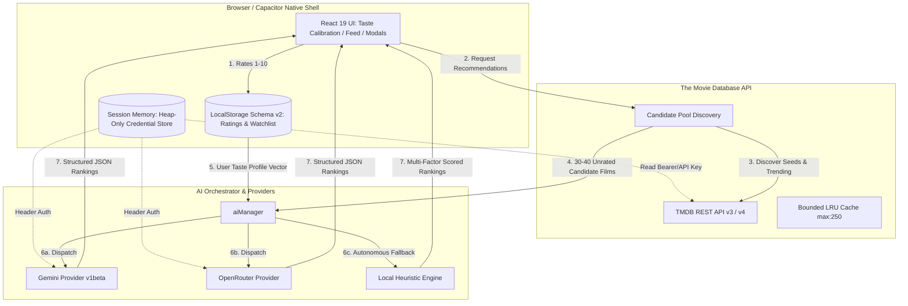

# CineMatch AI — Architecture & Documentation

**Version:** 1.1.0 (Standalone Architecture Revision)  
**Platform Targets:** Modern Web (Desktop/Mobile) & Android (Capacitor Native Shell)  

CineMatch AI is an AI-first movie recommendation and taste discovery application built with **React 19**, **TypeScript**, **Vite**, and **Tailwind CSS**. It combines real-time movie metadata from **The Movie Database (TMDB)** with a **Modular AI Service Architecture** (Google Gemini, OpenRouter, and an autonomous Local Heuristic Engine) to synthesize personalized, ranked recommendations based on a fine-grained 1–10 rating scale.

---

## 1. System Architecture & Zero-Backend Model

CineMatch operates on a **strict standalone client-to-API model**:
- **Zero Hosted Backend:** There is no server, proxy, database, or analytics collector.
- **Direct Client-to-API Calls:** Requests to TMDB, Google Gemini, and OpenRouter originate directly from the user's browser or native Capacitor webview.
- **BYOK (Bring Your Own Key):** Users configure their own TMDB credential and optional cloud AI keys.
- **Zero-Key Local Engine:** Users without AI keys can use the built-in **Local Smart Engine**, which performs multi-factor heuristic ranking completely offline.



---

## 2. Security & Credential Management Architecture

### A. Zero Secrets in Source Code or Web Disk
CineMatch contains **zero hardcoded API keys or tokens**. All credentials are user-supplied and handled under platform-specific confidentiality models:

1. **Web Platform (Browser):**
   - **Heap-Only Storage:** API keys (TMDB, Google Gemini, OpenRouter) are held exclusively in the JavaScript runtime heap (`credentialStore`).
   - **Never Persisted to Browser Storage:** Keys are **never** written to `localStorage`, `sessionStorage`, `IndexedDB`, Web Workers, cookies, or logs.
   - **Session Purge:** Reloading or closing the browser tab immediately clears all credentials from memory.

2. **Android Platform (Capacitor Native Shell):**
   - **Hardware-Backed AES-256-GCM Encryption:** When "Remember on this device" is enabled (default ON on Android), credentials are encrypted using platform AES-256-GCM with a non-exportable hardware key in Android Keystore (`com.cinematch.app.credentials.v1`).
   - **Crash-Safe Platform Storage:** Encrypted payloads are written atomically via Android platform `AtomicFile` inside `Context.getNoBackupFilesDir()`.
   - **Cloud Backup & Share Exclusion:** `android:allowBackup="false"` and restrictive FileProvider configuration ensure the vault is never synced to Google Drive or exposed via external shares.
   - **Independent Preference & Full Revocation:** Disabling the switch or clicking Forget immediately purges the encrypted snapshot and Keystore alias from the device while preserving current session usability.

3. **Confidentiality Protocols:**
   - **URL Redaction:** TMDB requests automatically redact API keys in logs and diagnostics via `redactTmdbUrl`.
   - **Header Authentication:** Gemini keys pass via the `x-goog-api-key` header (never in URL query strings). OpenRouter keys pass via `Authorization: Bearer <key>`.
   - **Decrypted Once on Startup:** Credentials decrypt once upon application launch into memory; no decryption overhead per API request.

---

## 3. Data Storage Schema (v2)

User taste profile data is persisted in browser `localStorage` using versioned keys with automatic schema migration and fallback handling for `QuotaExceededError`:

| Storage Key | Schema Type | Description |
| :--- | :--- | :--- |
| `cinematch_user_ratings_v2` | `Record<number, UserRating>` | User's rated movies, ratings (1–10), genres, director, timestamp. |
| `cinematch_watchlist_v2` | `number[]` | Array of bookmarked TMDB movie IDs. |
| `cinematch_watchlist_movies_v2` | `Record<number, Movie>` | Cached metadata for bookmarked movies for instant display. |
| `cinematch_ai_settings_v2` | `AISettings` | Non-sensitive preferences: active provider, model name, serendipity level, vibes, eras. *(Contains no secrets)*. |
| `cinematch_cached_recs_v2` | `CachedRecommendations` | Last successful recommendations with timestamp and provider metadata. |

---

## 4. Recommendation Engines

### 1. Google Gemini AI Provider
- **Models:** `gemini-3.8-flash` (recommended), `gemini-3.7-flash`, `gemini-2.5-flash`, `gemini-2.0-flash`, `gemini-1.5-flash`, `gemini-2.5-pro`.
- **Mechanism:** Sends structured prompts containing the candidate pool and user taste profile; returns JSON rankings with contextual rationales.
- **Resilience:** Strips markdown code blocks, enforces 20s timeout, and validates schema.

### 2. OpenRouter AI Provider
- **Models:** `deepseek/deepseek-r1:free`, `meta-llama/llama-3.3-70b-instruct:free`, `google/gemini-2.0-flash-exp:free`, `mistralai/mistral-small-24b-instruct-2501:free`.
- **Resilience:** Automatically strips DeepSeek R1 `<think>...</think>` tags and parses structured JSON.

### 3. Local Smart Engine (Zero-Key Heuristic)
- **Zero External API Calls:** Runs entirely in client JavaScript.
- **Scoring Dimensions:**
  - Genre Affinity: Weighted by user rating strength ($+3.0$ for 10/10, $-4.0$ for $\le 3/10$).
  - Director Match: $+15$ point boost for directors rated $\ge 8$.
  - Popularity & Quality: Log-scaled vote count and vote average.
  - Serendipity Temperature: Injects controlled variance based on the Serendipity slider.
  - Score Clamping: Clamped strictly in the $[45, 99]$ interval.

---

## 5. Mobile Ergonomics & Native Android (Capacitor)

- **Touch Targets:** Dual-row rating controls with $\ge 44\text{--}48\text{dp}$ touch targets for mobile accessibility.
- **Haptic Feedback:** `@capacitor/haptics` triggers light impact ticks on rating and clear actions.
- **Safe Area Insets:** Layout adapts dynamically to navigation bars and camera notches via `env(safe-area-inset-bottom)`.
- **Hardware Back Button:** Dismisses open modals first; double-taps on root feed to exit cleanly.
- **Native Sharing:** Seamless native share dialogs on Android using `@capacitor/share` with Web Share fallback.

---

## 6. Development & Testing

### Prerequisites
- Node.js `v20+` (tested on `v22.15.0`)
- npm `v10+`

### Setup & Commands
```bash
# Install dependencies
npm install

# Run development server
npm run dev

# Run TypeScript typecheck
npm run typecheck

# Run ESLint check
npm run lint

# Run automated tests
npm test

# Run test coverage
npm run test:coverage

# Build web production bundle
npm run build
```

### Android Development
```bash
# Build and sync assets to Capacitor
npm run build
npx cap sync android

# Open Android Studio
npx cap open android
```

---

## 7. Documentation Index

- [Production Readiness Audit](docs/production-readiness.md): Detailed requirement-by-requirement audit, test inventory, and unresolved external risks.
- [Release Verification Report](docs/verification-report.md): Execution outputs, benchmark measurements, bundle breakdown, and evaluation matrices.
- [Production Release Runbook](docs/release-runbook.md): Step-by-step deployment guide for Web and Capacitor Android.
- [Android Remember Credentials Specification (v1.1)](docs/android-remember-credentials-spec.md): Architectural and security specification for persistent encrypted credentials on Android.
- [Android Remember Credentials Verification Report](docs/android-remember-credentials-verification.md): Technical verification report, binary delta analysis (+9.49 KiB), test matrix, and release gates.
